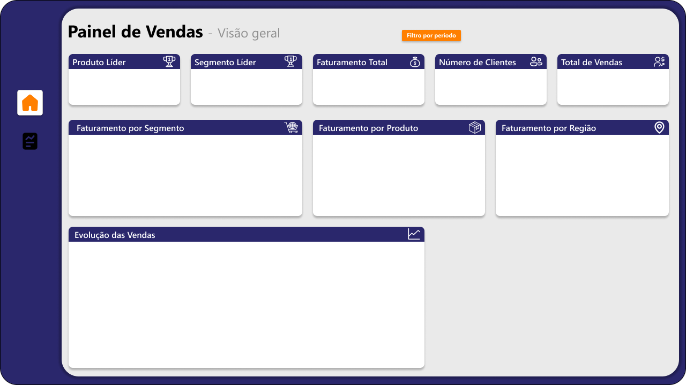
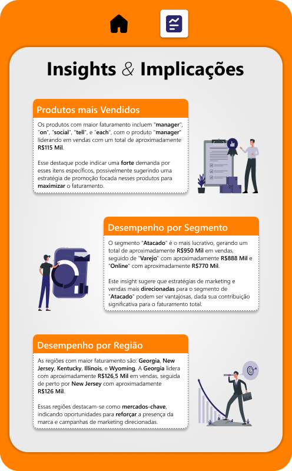

# Painel de vendas em Power BI




## Descrição

Este projeto apresenta um dashboard interativo desenvolvido no Power BI para análise de dados de vendas, proporcionando insights valiosos para a equipe de vendas e gestão. O dashboard foi construído utilizando arquivos de dados CSV e inclui várias visualizações para facilitar a compreensão e análise dos dados. Confira o dashboard completo [aqui](https://app.powerbi.com/view?r=eyJrIjoiMzljYTZkYzAtYWQ3NC00NDMwLWIwNzgtNzBkYzI1NDFjMzg1IiwidCI6IjJjYjZmMGIwLWZiMDktNGM5Mi1iNWYzLTQ0N2ZiZThjOWVmZiJ9).

## Desenvolvimento

### 1. **Importação e Transformação de Dados**

Inicialmente, foram baixados três arquivos CSV:
- `Clientes.csv`
- `Produtos.csv`
- `Vendas.csv`

Uma análise exploratória foi realizada para identificar as relações entre as tabelas, definir as colunas de interesse e categorizar as tabelas como fatos ou dimensões. Usamos o Power Query no Power BI para importar esses arquivos e fizemos uma transformação nas colunas de preços, alterando o separador decimal de "." para "," para adequar os dados ao formato local.

### 2. **Modelagem de Dados**

- **Tabela Fato:** `Vendas`
- **Tabelas Dimensões:** `Clientes` e `Produtos`

A relação entre as tabelas dimensões e a tabela fato é do tipo 1xN, garantindo uma modelagem correta dos dados.

### 3. **Visualizações Criadas**

O dashboard inclui as seguintes visualizações:

- **Cartões:**
  - "Produto Líder"
  - "Segmento Líder"
  - "Faturamento Total"
  - "Número de Clientes"
  - "Total de Vendas"
- **Gráficos:**
  - Rosca de "Faturamento por Segmento"
  - Barras de "Faturamento por Produto"
  - Barras de "Faturamento por Região"
  - Área de "Evolução das Vendas"
  - Mapa de "Mapa de Vendas"

### 4. **Medidas DAX Utilizadas**

Para algumas visualizações, especialmente os cartões "Segmento Líder", "Produto Líder" e "Total de Vendas", foram criadas medidas DAX específicas:

- **`TotalQuantidadeVendida`**: Calcula a soma da quantidade de produtos vendidos.
  ```DAX
  TotalQuantidadeVendida = SUM(ftVendas[Quantidade])
  ```

- **`SegmentoTopVendas`**: Identifica o segmento com o maior faturamento.
  ```DAX
    SegmentoTopVendas = 
    VAR TopSegmento =
        TOPN(
            1,
            SUMMARIZE(
                dimClientes,
                dimClientes[Segmento],
                "TotalVendasSegmento", SUM(ftVendas[Valor Total])
            ),
            [TotalVendasSegmento],
            DESC
        )
    RETURN
        MAXX(TopSegmento, dimClientes[Segmento])
  ```

- **`ProdutoTopVendas`**: Determina o produto com a maior quantidade vendida.
  ```DAX
    ProdutoTopVendas = 
    VAR TopProduto =
        TOPN(
            1,
            SUMMARIZE(
                dimProdutos,
                dimProdutos[Nome do Produto],
                "TotalQuantidade", SUM(ftVendas[Quantidade])
            ),
            [TotalQuantidade],
            DESC
        )
    RETURN
        MAXX(TopProduto, dimProdutos[Nome do Produto])
  ```

### 5. **Design e Storytelling**

O design do dashboard foi cuidadosamente planejado utilizando o Figma, seguindo as melhores práticas de design de dashboards e conceitos de storytelling. A paleta de cores, fontes e outros elementos visuais estão disponíveis no arquivo `.fig` incluído neste repositório.

## Contribuições

Contribuições são bem-vindas! Sinta-se à vontade para abrir issues ou pull requests com sugestões ou melhorias.

